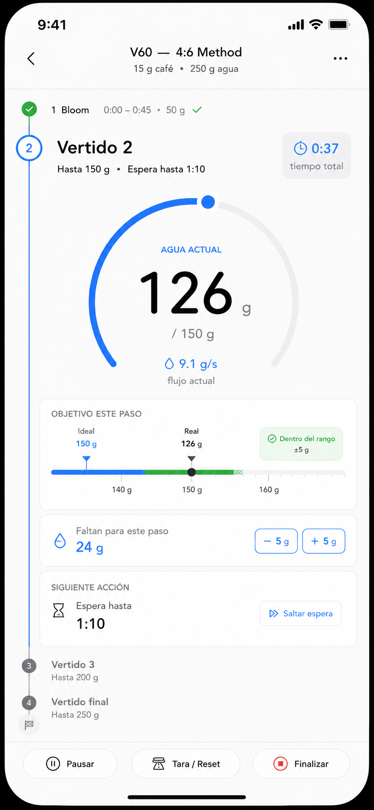

You are a Senior Product Designer, UX Designer and Senior React Native engineer.

Design and build a premium mobile-first coffee brewing application.

The goal is NOT to create another coffee timer.
The goal is to build the best specialty coffee companion for manual brewing.

Think Apple, Notion and Linear.
Minimal UI.
Large typography.
Almost zero cognitive load while brewing.

----------------------------------
DESIGN PRINCIPLES
----------------------------------

- Mobile first
- One-handed usage
- Dark and Light mode
- Minimal interactions while brewing
- Data rich AFTER brewing
- Beautiful animations
- Smooth transitions
- Haptic feedback
- Voice ready
- Bluetooth scale ready
- Offline first

During brewing the user should never have to navigate through menus.

The brewing screen should only show the essential information.

----------------------------------
NAVIGATION
----------------------------------

Bottom navigation with 5 tabs

• Brew
• Recipes
• Coffees
• History
• Settings

----------------------------------
BREW SCREEN
----------------------------------

This is the heart of the application.

Large timer

Large current weight

Current target

Remaining grams

Current pour number

Vertical recipe timeline on the left

Visual tolerance bar

Current flow (g/s)

Next action

Examples

Bloom

50 g

Waiting...

Next pour in

00:18

When pouring

Current

126 g

Target

150 g

Remaining

24 g

If user exceeds target

Target

150 g

Current

156 g

+6 g

Automatically adjust next pour.

Never require manual calculations.

Support

Pause

Reset

Finish

Skip waiting

Auto progression when connected to Bluetooth scale.

----------------------------------
POST BREW
----------------------------------

Once brewing finishes

Show a completely different experience.

Charts

Flow over time

Water over time

Pour speed

Recipe comparison

Ideal vs actual

Timeline

Brewing score

Consistency score

AI insights

Examples

Your bloom lasted 8 seconds longer.

Second pour was too aggressive.

Average flow was 8.9 g/s.

Try grinding one click finer.

----------------------------------
RECIPES
----------------------------------

Recipe library

Search recipes

Filter by

Brewer

Dose

Coffee

Creator

Favorites

Recipe detail

Name

Creator

Description

Brewer

Dose

Water

Temperature

Grind

Timeline

Each step

Target water

Wait time

Notes

Ability to duplicate

Share

Import

Export

----------------------------------
CREATE RECIPE
----------------------------------

Visual recipe editor

Timeline based

Drag and drop pours

Each step contains

Type

Pour

Wait

Stir

Swirl

Target weight

Duration

Notes

Recipe preview

Estimated total brew time

Live simulator

----------------------------------
COFFEES
----------------------------------

Coffee inventory.

Each coffee contains

Photos

Roaster

Coffee name

Origin

Region

Farm

Producer

Variety

Process

Altitude

Roast date

Purchase date

Price

Bag weight

Remaining coffee

Roast level

Roaster notes

Personal notes

Rating

Favorite

Ability to archive.

----------------------------------
SCAN COFFEE BAG
----------------------------------

Use camera.

Take one or multiple photos.

Automatically detect

Brand

Coffee name

Origin

Farm

Region

Altitude

Process

Variety

Roast date

Flavor notes

Roaster

Weight

Recommended recipe

OCR + AI extraction.

Show editable preview before saving.

If information is missing

Ask the user.

Store original images.

----------------------------------
BREWERS
----------------------------------

Support multiple brewing methods.

Examples

V60

Origami

Switch

Kalita Wave

Chemex

April Brewer

Orea

Aeropress

French Press

Clever

Moka

Espresso

Each brewer can define

Default ratios

Default recipes

Recommended filters

Recommended grind

Temperature ranges

Custom icons.

----------------------------------
BREW HISTORY
----------------------------------

Every brew automatically stores

Coffee

Recipe

Brewer

Grinder

Grind setting

Dose

Water

Temperature

Brew time

Flow data

Weight data

Bluetooth scale data

Notes

Rating

Location

Photos

Charts

Ability to compare brews.

----------------------------------
COFFEE ANALYTICS
----------------------------------

Dashboard

Average score

Favorite recipes

Favorite brewer

Extraction consistency

Average brew time

Coffee consumption

Coffee remaining

Cost per cup

Best performing recipes

Brewing frequency

Calendar

----------------------------------
BLUETOOTH SCALE
----------------------------------

Prepare architecture for Bluetooth scales.

Support

Acaia

Felicita

Timemore

Future integrations.

Auto detect

Auto tare

Auto timer

Auto pour progression

Live flow.

----------------------------------
SETTINGS
----------------------------------

Units

Metric

Imperial

Language

Theme

Notifications

Bluetooth

Backup

Cloud sync

Export data

Import data

